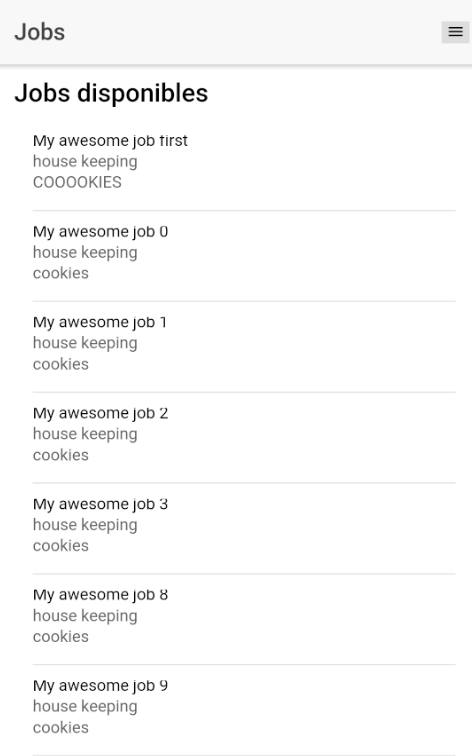
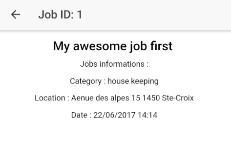
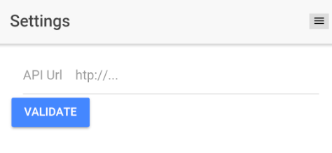
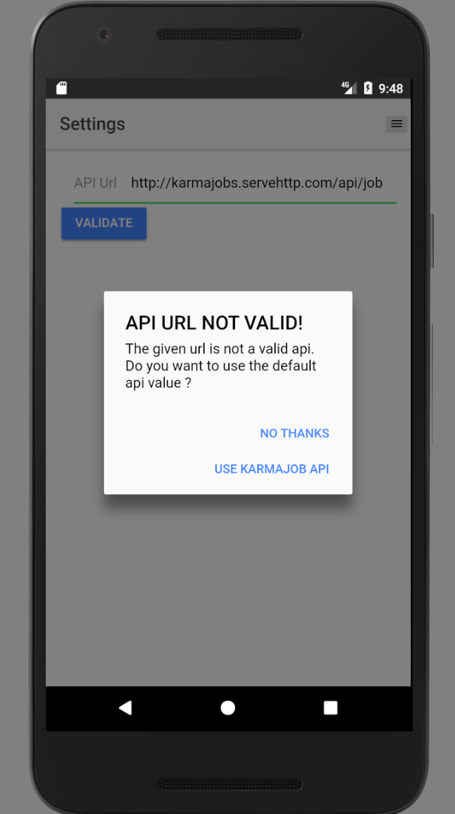
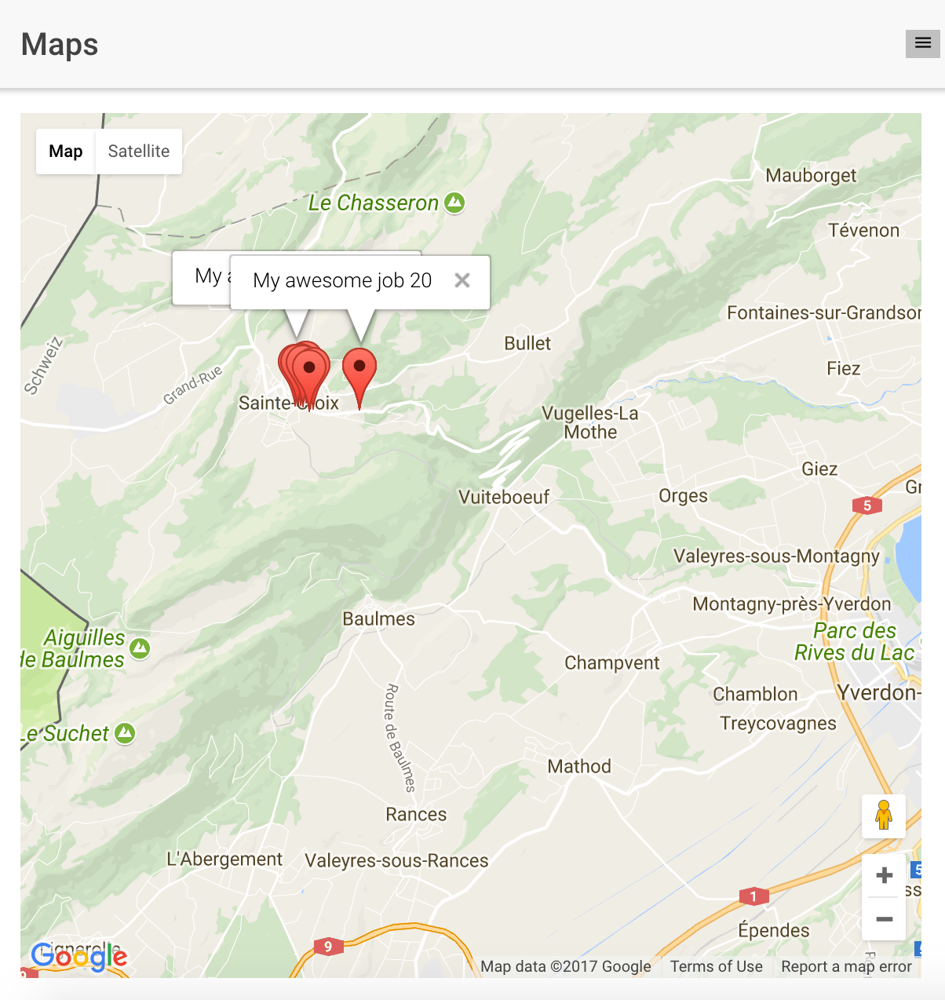
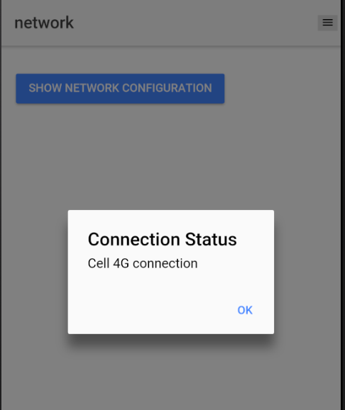

## Validation
Here's a briev description of the functionnalities avaiable on the v1.0.0.

### Web service
The central component of the application are the jobs. All the avaiable jobs are taken from the web api http://karmajobs.servehttp.com/api/jobs.  
Then, each job is displayed in a scrollable list
.    
When you click on any job, the details are displayed
.  

### Setting URL api
The url to get the jobs is customable. We strongly recommend to use the http://karmajobs.servehttp.com/api/jobs for testing, but you can change it as you like    
.  
If the url is not valid, a pop-up alert will inform you  
.  
Then the setting is stored in the device.

### Location
The location component allow the user to see the avaiable jobs on a map  
.  
**The map is not centered to the user location** as wanted. Refer to the **Bugs** for the details.  
The map can still be displayed with the jobs' details markers on it.

### Network status
This page allow the user to know if he is or not connected to the internet.
A pop-up alert is displayed to the user when he press the 'Show network configuration' button  
.  
The application can manage differents connection states.
- Unknown connection
- Ethernet connection
- Wifi connection
- Cell 2G connection
- Cell 3G connection
- Cell 4G connection
- Cell generic connection
- No network connection

## Remaining Bugs
The Cordova plugin **'geolocation'** throws a Timeout error when getting current the position coordinates.
No solution seems to be found for this issue, as you can see [here](https://stackoverflow.com/questions/29411697/timeout-about-geolocation-always-reached-when-position-mode-is-set-to-device-on) or [here](https://github.com/ionic-team/ng-cordova/issues/743).
So we only display the map with the jobs markers, but the map is not centered on the current position (instead the value is hard-coded to 'Sainte-Croix'.  
Sometimes the module works when we reboot the phone or when we manually send the GRP data point in an emulator.

